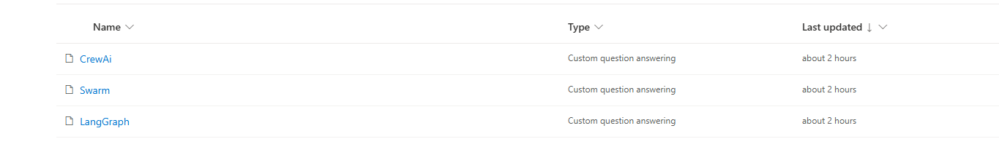

[app](https://agentsfwqnaappcarlos.streamlit.app/)

# Azure Question Answering Chat

## Descripción
Esta es una aplicación de chatbot basada en **Streamlit** que se integra con **Azure Question Answering** para proporcionar respuestas basadas en inteligencia artificial. Permite a los usuarios seleccionar diferentes **proyectos de QnA** y conversar con ellos a través de una interfaz de chat.

## Características
- **Selección de proyecto:** Los usuarios pueden elegir entre múltiples proyectos QnA (**CrewAi, Swarm, LangGraph**).En el lenguage services he creado 3 proyectos para que tenga cada framework sus prewguntas y respuestas(Solo me deja desplegar 2 por eso en la UI solo hay CrewAi y LangGraph).

- **Chat interactivo:** Los usuarios pueden escribir preguntas o seleccionar preguntas de ejemplo para obtener respuestas generadas por IA.
- **Preguntas de ejemplo:** Hay preguntas de ejemplo para cada framework
- **Historial de chat:** La conversación se guarda por proyecto.
- **Integración con Azure:** Las consultas se envían a Azure Question Answering y las respuestas se muestran en tiempo real.

